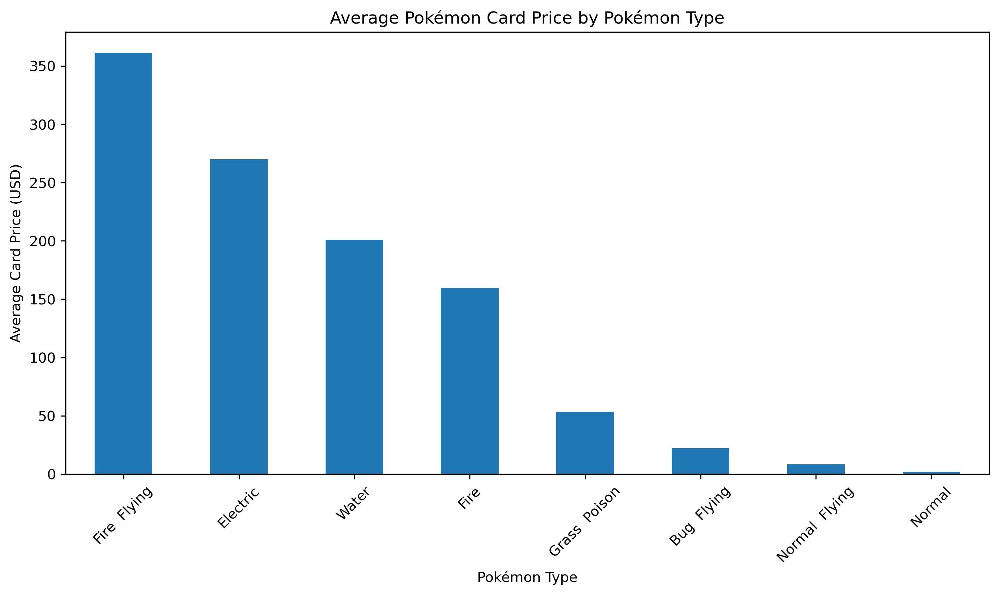
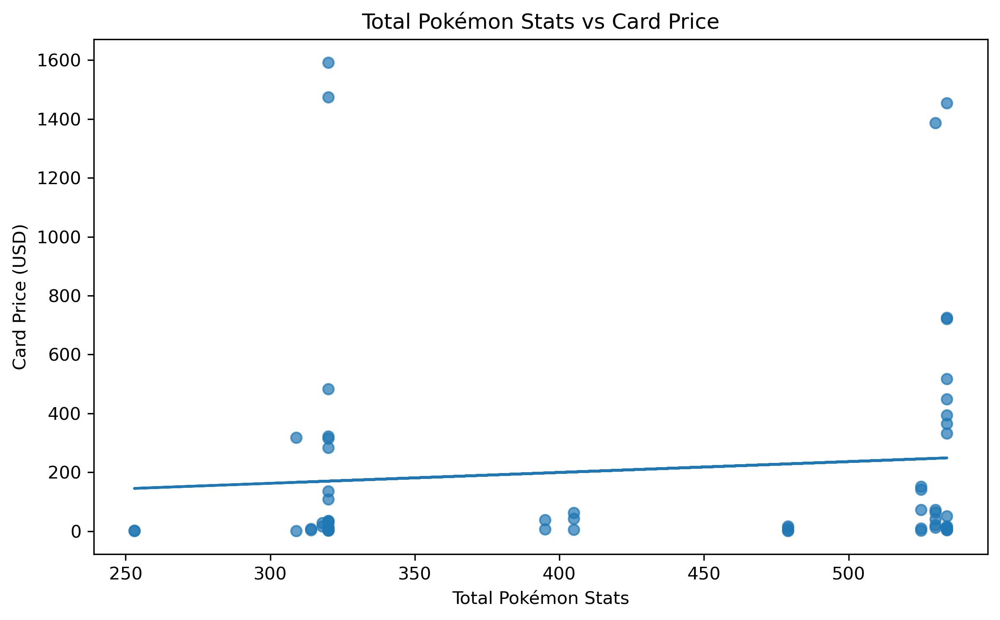
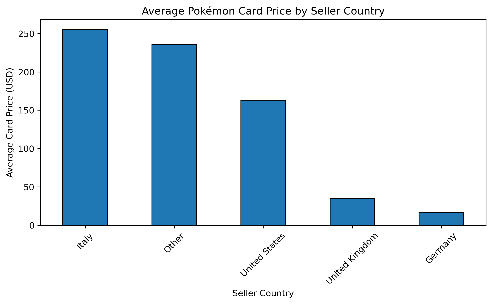

# Pokémon Market Analytics

Data analytics project integrating Pokémon statistics, PokéAPI data, and trading card marketplace pricing using Python, SQL, SQLite, and data visualization.

---

### Skills Demonstrated

- Data Cleaning & Preparation
- API Integration
- Web Data Extraction
- SQLite Database Construction
- SQL Joins
- Exploratory Data Analysis
- Data Visualization
- Analytical Reporting

## Project Files

- 📓 [Download Jupyter Notebook](Pokemon_Market_Analytics_SQL.ipynb)
- 🌐 [View HTML Notebook Export](Pokemon_Market_Analytics_SQL.html)

## Project Overview

This project combines Pokémon game statistics, PokéAPI attributes, and Pokémon trading card marketplace pricing data into a unified analytical database. Data from multiple sources were cleaned, standardized, integrated using SQL joins, and analyzed through visualizations to explore factors associated with Pokémon card values.

The project demonstrates an end-to-end data analytics workflow including:

- Data acquisition
- Data cleaning
- Database construction
- SQL integration
- Exploratory analysis
- Data visualization

---

## Project Visualizations

The following visualizations were generated from the final integrated SQLite dataset and highlight key relationships between Pokémon characteristics and marketplace pricing.

### Average Pokémon Card Price by Pokémon Type

**Key Finding:** Pokémon card rarity appeared to have a stronger influence on market value than Pokémon type alone.

### Total Pokémon Stats vs Card Price

**Key Finding:** Total battle statistics showed only a weak relationship with marketplace pricing, suggesting collectibility factors drive value more than competitive strength.

### Average Pokémon Card Price by Seller Country

**Key Finding:** Average card prices varied across seller regions, indicating differences in market demand, availability, and pricing behavior.

---

## Objectives

The primary goals of this project were to:

- Integrate multiple Pokémon-related datasets into a single analytical database
- Standardize and clean data collected from different sources
- Use SQLite and SQL joins to merge datasets
- Explore relationships between Pokémon characteristics and marketplace pricing
- Identify factors associated with card value and rarity
- Demonstrate practical data analytics and database management skills

---

## Data Sources

### Pokémon Statistics Dataset

Contains Pokémon battle statistics including:

- HP
- Attack
- Defense
- Speed
- Total Base Stats
- Pokémon Types

### PokéAPI

API-derived attributes including:

- Height
- Weight
- Base Experience

### Pokémon Trading Card Marketplace Data

Contains marketplace information including:

- Card Price
- Card Condition
- Seller Country
- Card Rarity

## Technologies Used

- Python
- Pandas
- NumPy
- SQLite
- SQL
- Requests
- Matplotlib
- Seaborn
- Jupyter Notebook

---

## SQL Database Integration

The cleaned datasets were loaded into SQLite as separate tables and merged using SQL INNER JOIN operations based on Pokémon names.

This integration created a consolidated analytical dataset combining:

- Pokémon statistics
- API attributes
- Marketplace pricing information

---

## Key Findings

- Pokémon card rarity appeared to have a stronger relationship with market value than battle statistics.
- Card condition and grading status appeared to substantially influence marketplace pricing.
- Marketplace values varied across seller regions.
- SQL joins successfully integrated three independent datasets into a unified analytical database.
- Data cleaning and standardization were critical for maintaining consistency across sources.

---

## Future Improvements

- Historical card price tracking
- Predictive card value modeling
- Interactive dashboards using Plotly or Streamlit
- Expanded marketplace datasets
- Time-series analysis of Pokémon card prices

---

## Author

Stephanie Nord

Master's Student in Data Science

Bellevue University
